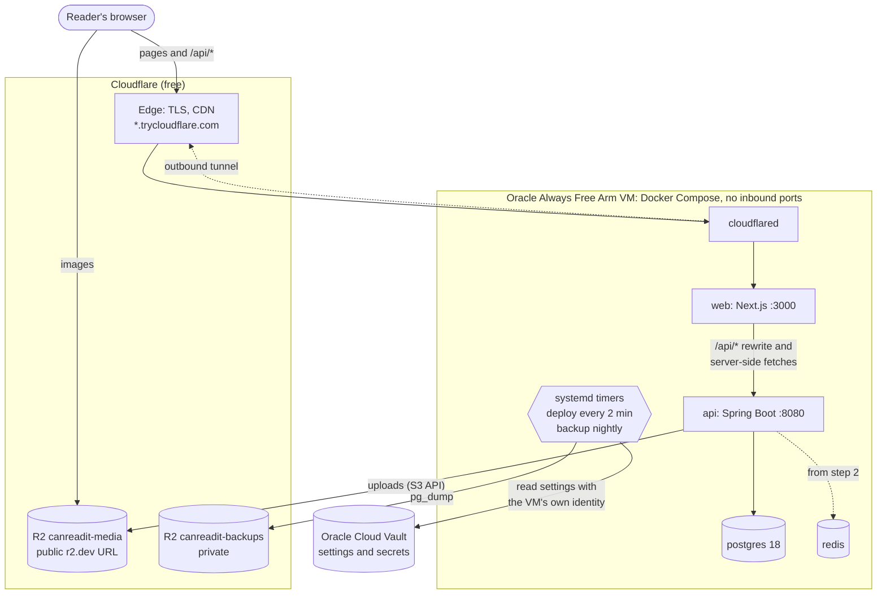
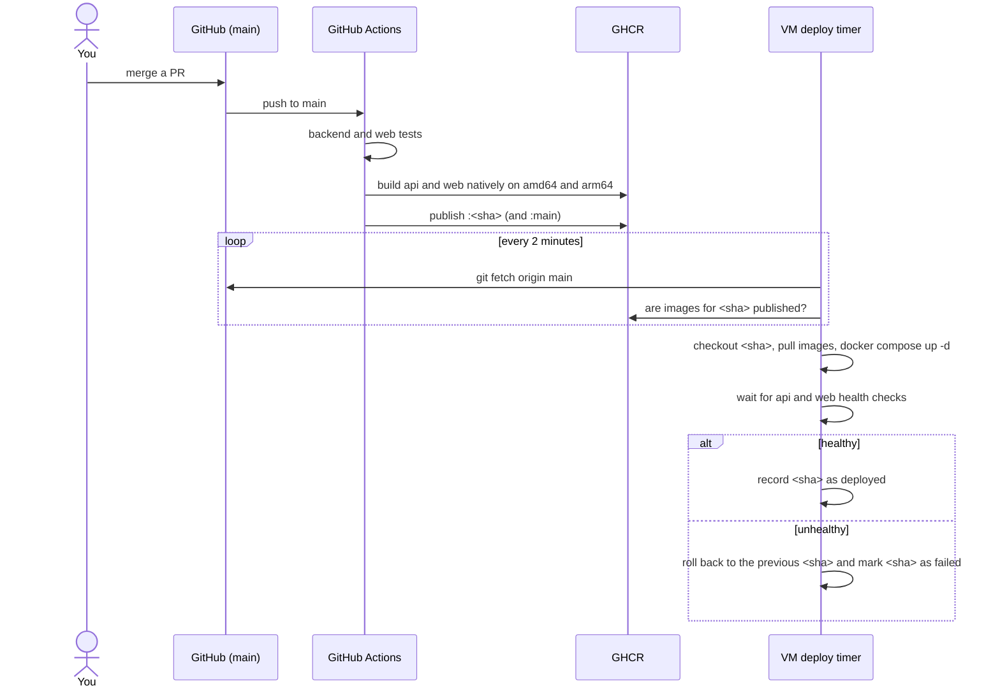
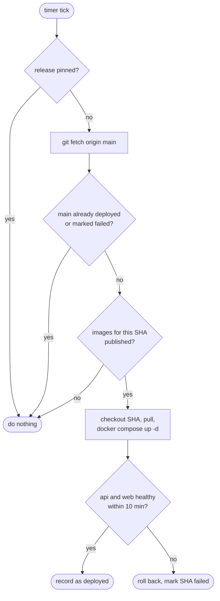

# Deployment: the $0 beta

This covers how the beta is hosted, how a change gets from a merged PR to the live site, how to set it up the first time, and how to operate it day to day. The decisions behind it are in [ADR 0010](decisions/0010-pull-based-deploys-and-quick-tunnel.md) and CLAUDE.md §9.

**Everything here costs $0.** It runs on an Oracle Cloud Always Free Arm VM and Cloudflare's free plan, R2 free tier, GitHub Actions and GHCR. There is no domain yet, so the site is reached through a Cloudflare *quick tunnel* at a random `https://<words>.trycloudflare.com` address. [Moving to a domain](#moving-to-a-domain-later) is a configuration change.

## At a glance

```
 Reader ──HTTPS──► Cloudflare edge (*.trycloudflare.com) ◄══ outbound tunnel ══╗
    │                                                                          ║
    │ images                     Oracle Always Free Arm VM (no inbound ports)   ║
    ▼                            ┌───────────────────────────────────────────┐ ║
 R2 bucket (public r2.dev) ◄──── │ cloudflared ══╝                           │
 R2 bucket (private backups) ◄── │   └► web (Next.js) ──/api/*──► api (Spring)│
                                 │                         postgres · redis  │
 GitHub Actions ──images──► GHCR │ systemd: deploy every 2 min, backup 03:17 │
                     ▲           └───────────────────────────────────────────┘
                     └── the VM polls GitHub and GHCR; nothing pushes to it
```

| Piece | Where | Cost |
|---|---|---|
| Compute | Oracle Always Free Arm VM (2 OCPU, 12 GB), Ubuntu 24.04, Docker Compose | $0 |
| Public entry | Cloudflare quick tunnel (random `trycloudflare.com` address) | $0 |
| Images (covers, pages) | Cloudflare R2 `canreadit-media`, public through its `r2.dev` address | $0 (10 GB free) |
| Database backups | Cloudflare R2 `canreadit-backups` (private), nightly `pg_dump` | $0 |
| Settings and secrets | Oracle Cloud Vault, one secret read with the VM's own identity | $0 |
| Container images | GitHub Container Registry (`ghcr.io/atulrwt23/can-read-it-{api,web}`) | $0 (public) |
| Builds | GitHub Actions, native amd64 and arm64 runners | $0 (public repo) |

## How it works

### Serving a request



1. The browser only talks to Cloudflare. `cloudflared` on the VM keeps an **outbound** connection to Cloudflare, and requests travel back down it. No port on the VM is open to the internet; SSH is for you only.
2. A quick tunnel forwards to one service, so everything goes to **web**. The Next.js server renders pages (fetching data from `http://api:8080` on the private Docker network) and proxies `/api/*` to the API. Public pages are cached with ISR and carry `Cache-Control: s-maxage`, so Cloudflare can cache them too.
3. **Images never pass through the VM.** The API returns image URLs on R2's public address, and the browser loads them from Cloudflare directly.
4. The API talks to **Postgres** on the Docker network and writes images to R2 over the S3 API. Redis is running but unused until step 2.

### Shipping a change



- **Pull-based.** Nothing (not CI, not you) connects *into* the VM to deploy. A systemd timer on the VM runs [`infra/prod/deploy.sh`](../infra/prod/deploy.sh) every 2 minutes. CI needs no credentials for the VM, and the VM needs no inbound ports.
- **Only green commits deploy.** CI publishes the `:<sha>` images only after the backend and web tests pass. A commit whose tests fail never gets images, so the VM never deploys it.
- **Config travels with the code.** The VM checks out the same commit as the images, so `compose.yml` and the scripts always match the release.
- **Automatic rollback.** If the new API or web container isn't healthy within 10 minutes, the previous release is restored and the bad SHA is recorded in `/opt/canreadit/state/failed`, so it isn't retried every 2 minutes. The next commit on `main` is tried as usual.
- **Timing.** From merge to live: CI (about 5 to 10 minutes) plus at most 2 minutes for the timer, plus about 10 seconds for containers to restart. During that restart the API is briefly unavailable.
- **Migrations run when the API starts**, and a rollback does not undo them. Every migration must keep the previous release working (expand now, contract in a later release).

This is the decision logic in `deploy.sh`:



### What runs on the VM

| Container | Image | Memory limit | Notes |
|---|---|---|---|
| `cloudflared-quick` | `cloudflare/cloudflared` | none | Quick tunnel. Its address changes whenever this container restarts. |
| `web` | `ghcr.io/atulrwt23/can-read-it-web:<sha>` | 1 GB | Next.js standalone, non-root, `/healthz` health check. |
| `api` | `ghcr.io/atulrwt23/can-read-it-api:<sha>` | 2.5 GB | Spring Boot (`prod,demo` profiles), non-root, read-only filesystem. |
| `postgres` | `postgres:18.6-alpine` | 3 GB | Data in the `canreadit-prod_postgres-data` volume. |
| `redis` | `redis:8.10.2-alpine` | 320 MB | Unused until step 2. |

A fresh stack uses about 600 MB, which leaves plenty of room on the 12 GB VM.

Files on the VM:

```
/opt/canreadit/
├─ secrets.conf  where settings come from: SECRETS_PROVIDER=oci-vault plus the secret's OCID (not secret)
├─ .env          settings, only if SECRETS_PROVIDER=file (chmod 600, never in git)
├─ repo/         a clone of this repository, checked out at the deployed commit
└─ state/
   ├─ deployed   SHA of the running release
   ├─ failed     SHAs that failed their health checks (not retried automatically)
   └─ pinned     present only while an operator has pinned a release

/run/canreadit/env   settings fetched from Vault on each run (memory only, root only, gone on reboot)
```

### Content, search engines and data

- The beta runs the **`demo` profile**: on its first start against an empty database, the API seeds the invented placeholder series and uploads their generated images to R2. It never seeds a database that already has series.
- Until launch every response carries `X-Robots-Tag: noindex, nofollow` and `robots.txt` disallows everything. Building the web image with `ALLOW_INDEXING=true` lifts this.
- **Backups:** every night at 03:17 UTC, `backup.sh` dumps Postgres (`pg_dump --format=custom`) and uploads it to `canreadit-backups`. An R2 lifecycle rule deletes dumps after 30 days. Images live in R2 already, so they need no backup.

### Security

- No inbound ports except SSH (restricted to your key). All web traffic arrives over the outbound tunnel.
- Secrets live in **Oracle Cloud Vault**. The VM reads them with its own identity (an *instance principal*), so no credential is stored on it, and the fetched copy lives only in memory (`/run/canreadit/env`). CI never sees them, because it doesn't deploy. A plain `/opt/canreadit/.env` is supported as a fallback.
- Containers run as non-root with `no-new-privileges`. The API filesystem is read-only, and the API and web drop all Linux capabilities.
- The VM installs OS security updates automatically (`unattended-upgrades`).

## First-time setup

You need your Oracle Cloud and Cloudflare accounts. This takes about 30 minutes.

### 1. Cloudflare R2: buckets and keys

1. In the Cloudflare dashboard, open **R2** and create the bucket **`canreadit-media`**.
2. Open its **Settings**. Under **Public access**, allow the **R2.dev subdomain**, then copy the `https://pub-….r2.dev` address. It becomes `MEDIA_PUBLIC_BASE_URL`.
3. Create a second bucket, **`canreadit-backups`**, and keep it private. Under **Settings → Object lifecycle rules**, add a rule that deletes objects with the prefix `postgres/` after 30 days.
4. Under **R2 → Manage API tokens**, create a token with **Object Read & Write** on `canreadit-media` only. Copy the Access Key ID and Secret Access Key: they become `S3_ACCESS_KEY` and `S3_SECRET_KEY`.
5. Create another token with **Object Read & Write** on `canreadit-backups` only, for `BACKUP_S3_ACCESS_KEY` and `BACKUP_S3_SECRET_KEY`. Separate tokens mean a leaked media key can't touch your backups.
6. Note your S3 endpoint, `https://<ACCOUNT_ID>.r2.cloudflarestorage.com` (shown on the R2 overview page). It goes in both `S3_ENDPOINT` and `BACKUP_S3_ENDPOINT`.

### 2. Oracle Cloud: the VM

1. **Compute → Instances → Create instance.**
   - **Image:** Canonical Ubuntu 24.04. The Ampere shape picks the aarch64 build automatically.
   - **Shape:** Ampere `VM.Standard.A1.Flex`, 2 OCPU, 12 GB memory (within the Always Free limit).
   - **Boot volume:** 100 GB (Always Free includes 200 GB in total).
   - **Networking:** the default VCN with a public IPv4 address. The default security list allows only SSH (22), and that's all it needs.
   - Add your SSH public key.
2. If Oracle says the shape is "out of capacity", try another availability domain, or retry later.
3. Optional but recommended: upgrade the account to **Pay As You Go** with a $0 budget alert. Always Free resources stay free, and Oracle no longer reclaims the VM when it looks idle.

### 3. Bootstrap the VM

```bash
ssh ubuntu@<vm-public-ip>
curl -fsSL https://raw.githubusercontent.com/atulrwt23/can-read-it/main/infra/prod/bootstrap.sh | sudo bash
```

[`bootstrap.sh`](../infra/prod/bootstrap.sh) installs Docker and Oracle's `oci` CLI, clones the repository to `/opt/canreadit/repo`, creates `/opt/canreadit/secrets.conf`, and enables the deploy and backup timers. It is safe to run again.

### 4. Put the settings in Oracle Cloud Vault

All production settings go into **one Vault secret** whose content is the whole env file: the same `KEY=value` lines as [`.env.example`](../infra/prod/.env.example). The deploy and backup scripts fetch it on every run.

**a. Write the content** (on your own computer, then keep it in your password manager):

- **Start from** [`infra/prod/.env.example`](../infra/prod/.env.example).
- **`POSTGRES_PASSWORD`:** generate one with `openssl rand -base64 32 | tr -d '/+='`.
- **`S3_*`, `MEDIA_PUBLIC_BASE_URL` and `BACKUP_*`:** the values from step 1. The `BACKUP_*` values can stay empty until you create the backups bucket; only the nightly backup fails until then.
- **Leave as they are:** `IMAGE_REGISTRY`, `COMPOSE_PROFILES=quick` and `SPRING_PROFILES_ACTIVE=prod,demo`.

**b. Create the vault, a key and the secret** (Oracle console, ☰ → **Identity & Security → Vault**):

1. **Create Vault:** name `canreadit`, in your root compartment (or the VM's compartment). Leave *virtual private vault* unticked.
2. Open it → **Master Encryption Keys → Create Key:** name `canreadit-secrets`, **Protection Mode: Software**, algorithm AES 256.
3. **Secrets → Create Secret:**
   - **Name:** `canreadit-prod-env`
   - **Encryption key:** `canreadit-secrets`
   - **Secret type template:** Plain-Text
   - **Secret contents:** paste the whole content from (a)
4. Open the new secret and copy its **OCID** (`ocid1.vaultsecret…`).

**c. Let the VM, and only the VM, read that secret:**

1. Open your instance and copy its **OCID** (`ocid1.instance…`).
2. ☰ → **Identity & Security → Domains → Default → Dynamic groups → Create dynamic group**. Name it `canreadit-vm`, with the matching rule:
   ```
   instance.id = '<instance OCID>'
   ```
3. ☰ → **Identity & Security → Policies** (root compartment) → **Create Policy**. Name it `canreadit-vm-secrets`, turn on the **manual editor**, and enter:
   ```
   Allow dynamic-group 'Default'/'canreadit-vm' to read secret-bundles in tenancy where target.secret.id = '<secret OCID>'
   ```
   This grants read access to that one secret, for that one VM, and nothing else.

**d. Point the VM at it:**

```bash
sudo nano /opt/canreadit/secrets.conf
#   SECRETS_PROVIDER=oci-vault
#   OCI_SECRET_ID=<secret OCID>
sudo /opt/canreadit/repo/infra/prod/secrets.sh check     # prints names only, never values
sudo rm -f /opt/canreadit/.env                           # the placeholder file is no longer used
```

`secrets.sh check` should end with "all settings present". A "NotAuthorizedOrNotFound" error usually means the policy hasn't taken effect yet (give it a minute) or an OCID doesn't match.

<details>
<summary>Alternative: keep the settings in a file on the VM instead</summary>

Leave `SECRETS_PROVIDER=file` in `/opt/canreadit/secrets.conf`, then put the same content in `/opt/canreadit/.env` (`sudo nano /opt/canreadit/.env`, which bootstrap created with `chmod 600`). Keep a copy in your password manager, because the VM is then the only other place it exists.
</details>

### 5. Container images

Nothing to do. CI publishes `ghcr.io/atulrwt23/can-read-it-api` and `-web` publicly for every green commit on `main`, and the VM pulls them without logging in. If a deploy ever logs "images … not published yet" for longer than a CI run takes, check the package visibility under github.com/atulrwt23 → **Packages** → **Package settings**.

### 6. First deploy

```bash
sudo systemctl start canreadit-deploy          # or just wait up to 2 minutes for the timer
journalctl -fu canreadit-deploy                # watch it: pull, start, seed, health checks
sudo /opt/canreadit/repo/infra/prod/tunnel-url.sh
```

The last command prints the public address, for example `https://gentle-river-words.trycloudflare.com`. The first start takes a few minutes, because the demo seeder uploads about 900 placeholder images to R2. For the first minute after a deploy, the home page can show "The catalogue is warming up" until its cache refreshes.

## Operating it

Set up a shortcut on the VM. [`crc.sh`](../infra/prod/crc.sh) is `docker compose` with the settings loaded the same way the deploy loads them and the image tag pinned to the deployed release. Use it for looking (ps, logs, exec); ship changes through `main` and `deploy.sh`.

```bash
alias crc='sudo /opt/canreadit/repo/infra/prod/crc.sh'
```

| Task | How |
|---|---|
| Ship a change | Merge the PR. It goes live about 10 minutes later, if CI is green. |
| What's running? | `cat /opt/canreadit/state/deployed`, then `crc ps` |
| Public address | `sudo /opt/canreadit/repo/infra/prod/tunnel-url.sh` (it changes when cloudflared restarts, for example on reboot) |
| Deploy history and errors | `journalctl -u canreadit-deploy --since today` |
| Application logs | `crc logs -f --tail 100 api` (or `web`). API logs are JSON (ECS format). |
| Timers | `systemctl list-timers 'canreadit-*'` |
| Deploy now | `sudo systemctl start canreadit-deploy` |
| Roll back to an older release | `sudo /opt/canreadit/repo/infra/prod/deploy.sh --pin <sha>` (the timer then leaves it alone) |
| Resume following `main` | `sudo /opt/canreadit/repo/infra/prod/deploy.sh --unpin` |
| Retry a release marked failed | `sudo /opt/canreadit/repo/infra/prod/deploy.sh --force <sha>`, or push a fix (the next commit is tried automatically) |
| Change a secret or setting | Vault → `canreadit-prod-env` → **Create Secret Version** (paste the full content), then `sudo /opt/canreadit/repo/infra/prod/deploy.sh --force` |
| Check the settings | `sudo /opt/canreadit/repo/infra/prod/secrets.sh check` (names only, never values) |
| Back up now | `sudo systemctl start canreadit-backup && journalctl -u canreadit-backup -n 20` |
| Database shell | `crc exec postgres psql -U canreadit` |

The permanent way to undo a bad change is a revert PR on `main`: it goes through CI like any other change. `--pin` is for emergencies. Remember to `--unpin` afterwards.

### Restore a backup

Rehearse this once before the beta opens, and after any change to backups.

```bash
# 1. Find a dump (from any machine with the AWS CLI and the backups key).
aws s3 ls s3://canreadit-backups/postgres/ --endpoint-url https://<ACCOUNT_ID>.r2.cloudflarestorage.com

# 2. On the VM: pause deploys, stop the API, and restore into a fresh database.
sudo systemctl stop canreadit-deploy.timer
crc stop api web
aws s3 cp s3://canreadit-backups/postgres/<file>.dump /tmp/restore.dump --endpoint-url https://<ACCOUNT_ID>.r2.cloudflarestorage.com
crc exec -T postgres dropdb -U canreadit canreadit
crc exec -T postgres createdb -U canreadit canreadit
crc exec -T postgres pg_restore -U canreadit -d canreadit --no-owner < /tmp/restore.dump

# 3. Bring everything back.
sudo /opt/canreadit/repo/infra/prod/deploy.sh --force
sudo systemctl start canreadit-deploy.timer
```

The AWS CLI isn't installed on the VM. Run it through Docker: `docker run --rm -e AWS_ACCESS_KEY_ID=… -e AWS_SECRET_ACCESS_KEY=… -e AWS_DEFAULT_REGION=auto -v /tmp:/tmp amazon/aws-cli:2.37.4 <command>`.

### Reset the demo data

The seeder only runs against an empty database. To start over:

```bash
sudo systemctl stop canreadit-deploy.timer
crc down
sudo docker volume rm canreadit-prod_postgres-data
sudo /opt/canreadit/repo/infra/prod/deploy.sh --force
sudo systemctl start canreadit-deploy.timer
```

Old images stay in R2. Identical images are reused (storage is content-addressed), so reseeding doesn't grow the bucket.

### Troubleshooting

| Symptom | Likely cause | What to do |
|---|---|---|
| New commit isn't live after 15 min | CI failed, so no images were published | Check the Actions tab. Deploys resume with the next green commit. |
| `deploy` logs "images … not published yet" | CI still running (or failed) | Wait, or check the Actions tab ([step 5](#5-container-images)). |
| `deploy` logs "could not read the settings from Oracle Cloud Vault" | Dynamic group or policy missing, or a wrong OCID in `secrets.conf` | Recheck [step 4c](#4-put-the-settings-in-oracle-cloud-vault). Running containers are unaffected. |
| `deploy` logs "is unhealthy" and rolled back | The new release fails to start | `journalctl -u canreadit-deploy` shows the last 80 log lines of api and web. Fix and merge. |
| Site address stopped working | cloudflared restarted (reboot, update), so the quick-tunnel address changed | Run `tunnel-url.sh` for the new one. A domain fixes this for good. |
| Images don't load | Wrong `MEDIA_PUBLIC_BASE_URL`, or the r2.dev subdomain is disabled | Check the bucket's public access, fix the setting, then `deploy.sh --force`. |
| API won't start: "required variable … is missing" | An empty setting | Run `secrets.sh check`, fill it in, then `deploy.sh --force`. |

## Limits of the $0 setup

- **The quick-tunnel address changes** whenever `cloudflared` restarts. Quick tunnels have no uptime guarantee and are meant for testing. Fine for a private demo, not for a public launch.
- **`r2.dev` addresses are rate-limited** and not meant for production traffic.
- **One VM** is a single point of failure: backups cover the data, not uptime.
- **Deploys cause about 10 seconds of API downtime** while the container restarts.
- **Email:** Resend can only send to your own address until a domain is verified. That matters from step 2 (sign-in codes).

## Moving to a domain later

All of this is configuration. No code changes.

1. Add the domain to Cloudflare (Cloudflare Registrar sells domains at cost).
2. **Zero Trust → Networks → Tunnels → Create a tunnel** (Cloudflared). Copy its token and add these public hostnames:
   - `<domain>` with path `api/*` → `http://api:8080`
   - `<domain>` → `http://web:3000`
3. On the `canreadit-media` bucket, add a **custom domain** such as `cdn.<domain>`, then turn off the r2.dev subdomain.
4. In your settings (the Vault secret), set:
   - `COMPOSE_PROFILES=named`
   - `TUNNEL_TOKEN=<token>`
   - `MEDIA_PUBLIC_BASE_URL=https://cdn.<domain>`

   Then run `deploy.sh --force`. Image URLs are built on every request from that base address, so nothing stored has to change.
5. Optional: use **Cloudflare Access** in front of SSH, so port 22 can be closed as well.
6. Verify the domain in Resend (SPF and DKIM records) before step 2 needs email.
